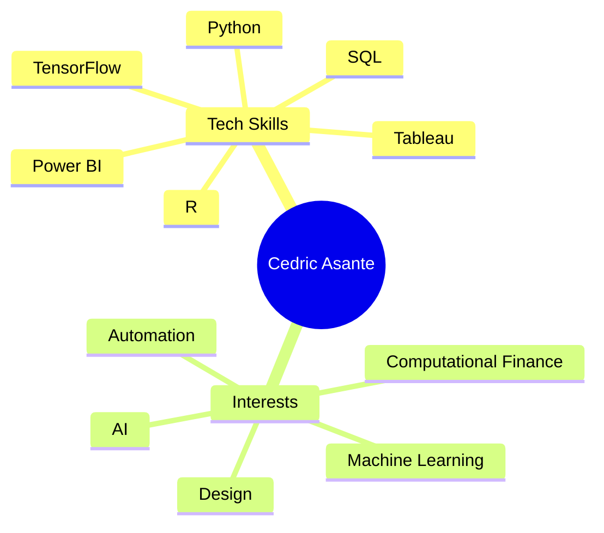
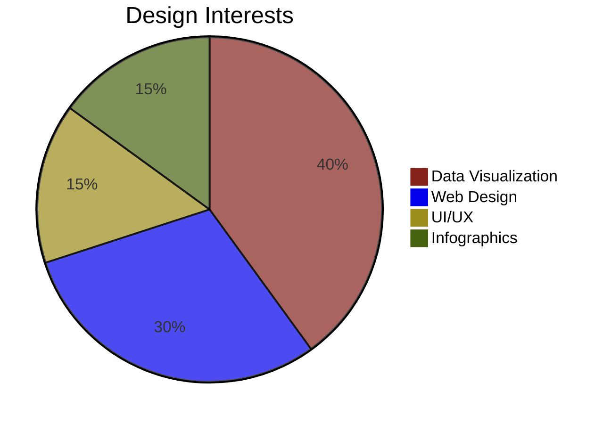

---

## 🛠️ **Toolbox**

<table>
  <tr>
    <td align="center"><b>Data Collection</b></td>
    <td align="center"><b>Data Cleaning</b></td>
    <td align="center"><b>Exploratory Analysis</b></td>
  </tr>
  <tr>
    <td align="center" style="font-size:1.1em;">📥</td>
    <td align="center" style="font-size:1.1em;">🧹</td>
    <td align="center" style="font-size:1.1em;">🔍</td>
  </tr>
  <tr>
    <td align="center"><b>Modeling & Prediction</b></td>
    <td align="center"><b>Visualization</b></td>
    <td align="center"><b>Decision Support</b></td>
  </tr>
  <tr>
    <td align="center" style="font-size:1.1em;">🤖</td>
    <td align="center" style="font-size:1.1em;">📊</td>
    <td align="center" style="font-size:1.1em;">💡</td>
  </tr>
</table>

---

## 🎨 **Design + Data**

---

## 🌐 **Connect With Me**

  
  &nbsp;&nbsp;
  
  &nbsp;&nbsp;
  

